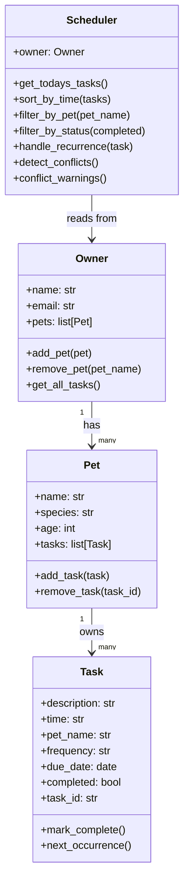
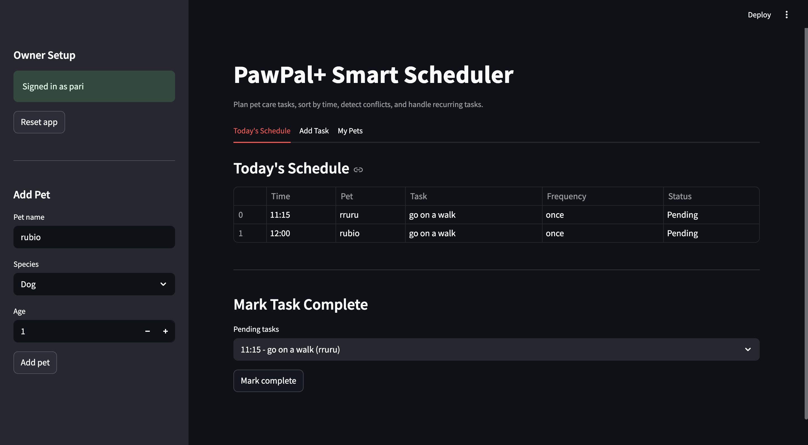

# PawPal+ (Module 2 Project)

PawPal+ is a Streamlit app that helps a pet owner manage daily pet care with a simple scheduling engine.

## Features

- Owner and pet management in a persistent Streamlit session
- Task scheduling by time (`HH:MM`), frequency, and due date
- Daily schedule view sorted chronologically
- Conflict warnings when two tasks share the same date/time slot
- Recurring task automation for `daily` and `weekly` tasks
- CLI demo script for backend verification
- Automated pytest suite for key scheduler behaviors

## System Design (Mermaid UML)



## Smarter Scheduling

The scheduler includes four algorithmic behaviors:

- Sorting: uses `sorted(..., key=lambda task: task.time)` for chronological order
- Filtering: returns subsets by pet name or completion status
- Recurrence: when a `daily` or `weekly` task is completed, a new task is automatically created with the next due date
- Conflict detection: flags exact slot collisions for same `date + time` without crashing

Tradeoff: conflict detection checks only exact time matches, not overlapping durations.

## Project Structure

- `pawpal_system.py`: backend classes and scheduling logic
- `app.py`: Streamlit UI integrated with backend
- `main.py`: terminal demo of scheduling behavior
- `tests/test_pawpal.py`: automated tests
- `reflection.md`: design and AI-collaboration reflection

## Run Locally

```bash
python -m venv .venv
source .venv/bin/activate  # Windows: .venv\Scripts\activate
pip install -r requirements.txt
```

Run CLI demo:

```bash
python main.py
```

Run Streamlit app:

```bash
streamlit run app.py
```

## Testing PawPal+

Run tests with:

```bash
python -m pytest -v
```

The suite validates:

- task completion behavior
- task addition and list growth
- chronological sorting correctness
- recurrence creation for daily tasks
- conflict detection for duplicate time slots

Confidence level: 4/5 stars.

## Demo

Add your final UI screenshot in this section after running the app:

